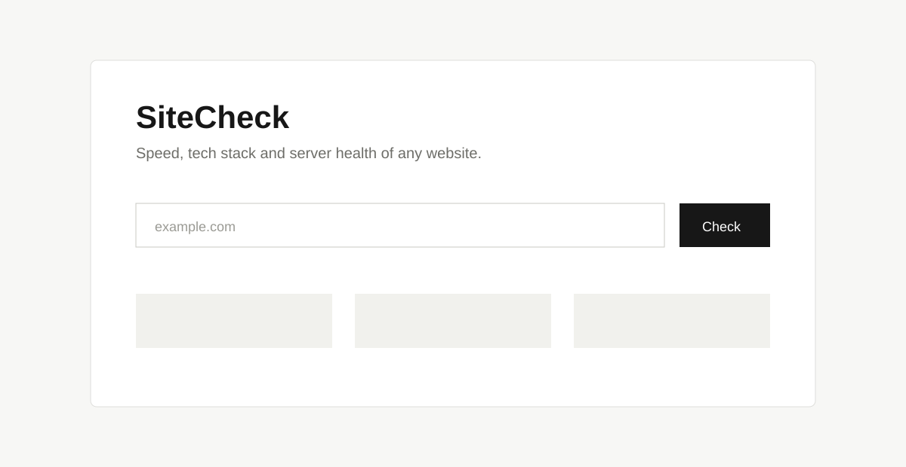

# SiteCheck

SiteCheck performs a quick technical audit of any public website. Enter a URL
to view response-time benchmarks, server health, detected technologies, and
basic page details.

The project has a dependency-free Node.js backend and a React + Vite frontend.

## Features

# SiteCheck

SiteCheck is a simple website health checker. Enter any public website URL to
check its speed, server health, HTTP status, redirects, and detected tech
stack.



## Install

Requirements: Node.js 18 or newer and npm.

```bash
npm install
npm run build
npm start
```

Open `http://localhost:3000` in your browser.

For frontend development, run the backend and frontend in separate terminals:

```bash
# Terminal 1
npm run dev:api

# Terminal 2
npm run dev:web
```

Then open `http://localhost:5173`.

## Deployment

Deploy the project as one Node.js web service on Render, Railway, or a similar
platform:

```text
Build command: npm run build
Start command: npm start
Node version: 18 or newer
```

No `.env` file is required. The platform provides `PORT` automatically. Do
not set `ALLOW_PRIVATE=1` in production.

## Backend

The backend is a dependency-free Node.js server. It serves the built frontend
and provides these API endpoints:

```text
GET /api/health
GET /api/analyze?url=example.com
```

It fetches public websites, measures response time, checks server health, and
detects technologies. Private network addresses are blocked for security.

## Frontend

The frontend is built with React and Vite. During development, Vite proxies
`/api` requests to the backend on port 3000. In production, the backend serves
the frontend from `frontend/dist`, so both parts use the same domain and no
frontend API URL is needed.

Run tests with:

```bash
npm test
```

src/
